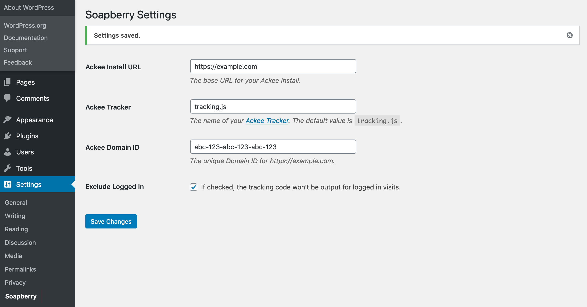

# Soapberry 

Gather data on site visits while respecting visitor privacy using Soapberry alongside a self-hosted Ackee instance.

## Description 

Soapberry makes it possible to use an externally hosted [Ackee](https://ackee.electerious.com/) analytics instance with your WordPress site without editing any code. It provides a settings page in WP Admin to add the required JavaScript tracking elements to your site's footer. 

To use this plugin, one must have access to an Ackee instance set up with a Domain ID and [CORS headers](https://github.com/electerious/Ackee/blob/master/docs/CORS%20headers.md) matching that of the WordPress domain.

The upstream Ackee project describes the project as a:
> Self-hosted, Node.js based analytics tool for those who care about privacy. Ackee runs on your own server, analyses the traffic of your websites and provides useful statistics in a minimal interface.

The plugin's current functionality is limited to the essential features of addding the JavaScript tracker to the footer with an option to disable tracking of logged in visits. In the future, this functionality might extend to tracking based on user roles or the ability to use Ackee's personalization analytics with the visitor's consent.

## Installation 

The quickest method for installing Soapberry is:

1. Visit Plugins -> Add New in the WordPress admin
1. Search for "Soapberry"
1. Click "Install Now"
1. Once the install is complete, click "Activate".
1. Go to the Settings -> Soapberry to add your Ackee settings.

If you would prefer to do things manually, then follow these instructions:

1. Upload the `soapberry` folder to the `/wp-content/plugins/` directory
1. Activate the plugin through the 'Plugins' menu in WordPress
1. Go to the Settings -> Soapberry to add the Ackee settings.

## Frequently Asked Questions 

### Why Soapberry? 

The [Ackee plant](https://en.wikipedia.org/wiki/Ackee) is in the Sapindaceae (soapberry) family. The name Soapberry strives to indicate this plugin is complementary to the work by the Ackee project while by unique enough to make clear that the two are not formally associated. Fun fact, the fruit of the Soapberry plant is used to make soap which is where Sapindus got its secondary name.

### The plugin is active but I do not see the tracking code. 

First, make sure your theme has the `wp_footer()` function added before the closing body tag. The plugin hooks into the WordPress footer, making this template tag required. 

If you're still not seeing the tracking code, make sure your settings have been saved, and you do not have the "Exclude Logged In" checkbox enabled. If you are excluding logged in visits, then try loading your site in a private tab or another browser.

## Screenshots 

## Changelog 

### 1.1.0
* Fixed: tracking script is now output with a line break at the end.+
* Fixed: Validation improvements for Ackee Domain ID and consent cookie fields.
* Enhancements: PHPCS ignore is more explicit.
* Added: Respects Do Not Track by default with an option to override and always output the tracker.
* Added: A cookie setting to allow visitors to opt-in to Ackee.
* Added: An option to output the `detailed` view.

### 1.0.0
* Inital release